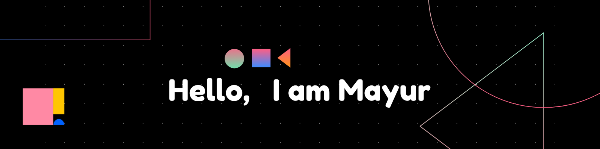

 

   <h1>Hi there, I'm <a href="https://github.com/mayur-mp">Mayur </a>  </h1>

  

  <h2 style="margin-: 0;" align='left' >👨‍💻 About Me</h2>
  <table style="border-collapse: collapse;">
    <tr>
      <td style="padding: 8px 16px; text-align: center;">👨‍💻</td>
      <td style="padding: 8px 16px; text-align: left;">Currently Pursing Masters in  Computer Application </td>
    </tr>
    <tr>
      <td style="padding: 8px 16px; text-align: center;">📚</td>
      <td style="padding: 8px 16px; text-align: left;">Learning everything about Web Development , Data Science , Full Stack , Android 😅</td>
    </tr>
    <tr>
      <td style="padding: 8px 16px; text-align: center;">💪🏼</td>
      <td style="padding: 8px 16px; text-align: left;">Future Goals: Learn more technologies - And Become  Full stack  Software Engineer.</td>
    </tr>
    <tr>
      <td style="padding: 8px 16px; text-align: center;">💬</td>
      <td style="padding: 8px 16px; text-align: left;">Ask me about  Java, Data Analysis , Web development </td>
    </tr>
 <tr>
      <td style="padding: 8px 16px; text-align: center;">💬</td>
      <td style="padding: 8px 16px; text-align: left;">Reach me : mayursarade0503@gmail.com  </td>
    </tr>

  </table>

<h2 style="margin-: 0;" align='center' >Lets connect through  </h2>

 <h2 style="margin-: 0;" align='left' >💻 My Tech Stack  </h2>
  
<h2 align="center">Languages and Tools</h2>

                    

 <h2 style="margin-: 0;" align='left' > 🤖 Github Stats  </h2>
<table><tr><td valign="top" width="50%">

</td><td valign="top" width="50%">

</td></tr></table>
 
